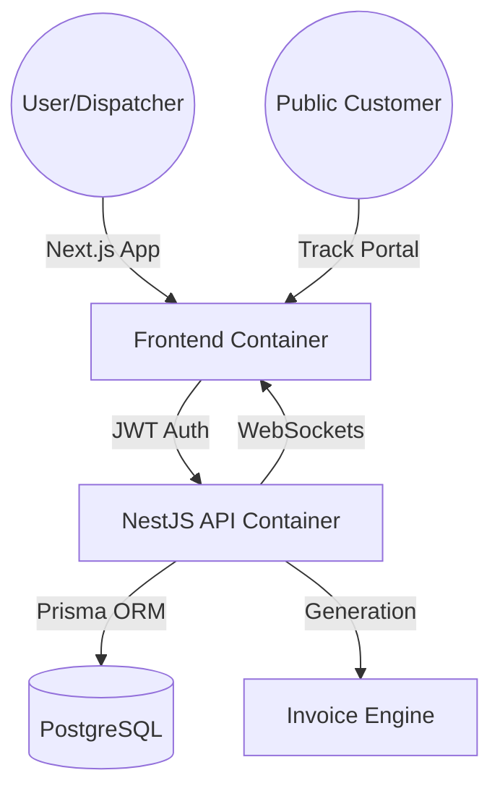
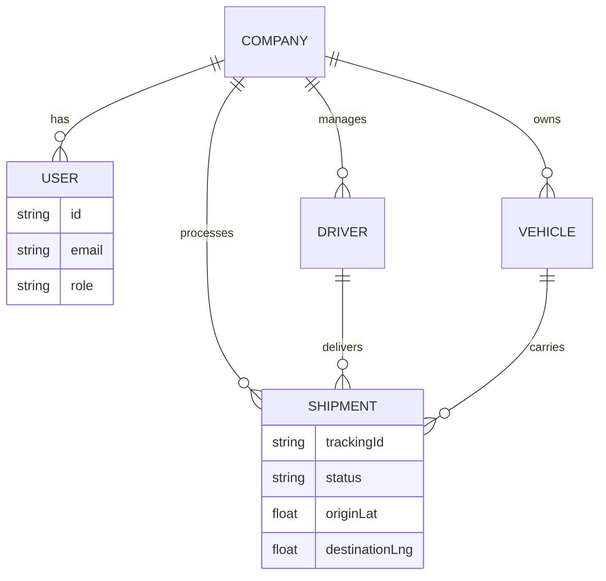
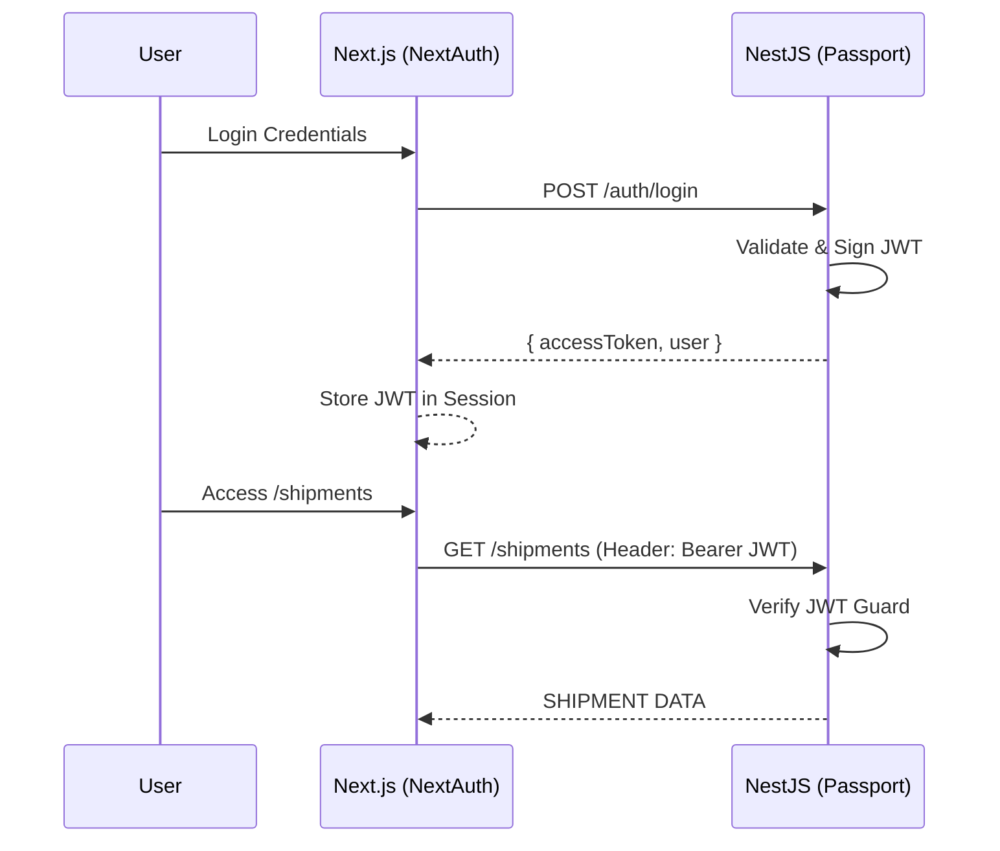
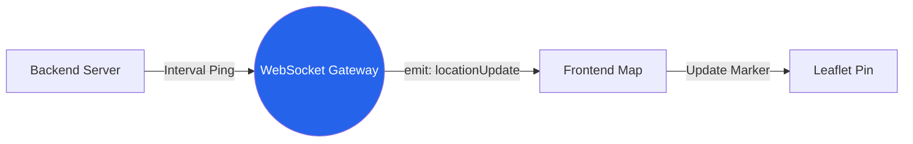

# LogiBoard | Enterprise Logistics Dashboard

LogiBoard is a high-performance, real-time logistics operations platform designed for modern shipping and dispatch teams. Built with a robust full-stack architecture, it offers seamless shipment tracking, fleet management, and automated invoicing.

## 🚀 Key Features
- **Real-Time Dashboards**: Reactive analytics powered by Socket.io and Recharts.
- **Interactive Tracking**: Public customer portal with live Leaflet map GPS telemetry.
- **Smart Auth**: Multi-tenant isolation using NextAuth and Passport-JWT.
- **Digital Invoicing**: Automated PDF generation for every shipment.
- **API Explorer**: Built-in Swagger/OpenAPI documentation.

## 🛠 Tech Stack
- **Frontend**: Next.js 15 (App Router), TailwindCSS, Recharts, Framer Motion.
- **Backend**: NestJS 11, Socket.io, PDFKit, Swagger.
- **Data**: PostgreSQL, Prisma ORM (v7).
- **Environment**: Docker, Playwright (E2E).

## 🏗 System Architecture



## 🎨 Visual Deep Dive

### 1. Data Model (ERD)
LogicBoard uses a Multi-Tenant schema where every entity is scoped to a `Company`.



### 2. Secure Auth Flow
Using NextAuth (Frontend) and Passport-JWT (Backend) for stateless session management.



### 3. Real-Time Tracking Loop
How the live Map and WebSockets keep consumers updated.



## 🏗 Technical Breakdown & Architecture

This section provides a deep analysis of the **LogiBoard** integration layers implemented across all stages of development.

---

### 1. Core Architecture & Tech Stack
LogiBoard is architected as a **Dual-Service Monolith** designed for high performance and scalability.
- **Backend (NestJS 11)**: Modular Node.js framework handling business logic, PostgreSQL orchestration (Prisma), and real-time gateways (Socket.io).
- **Frontend (Next.js 15)**: Utilizing the **App Router** for server-side performance and **Client Components** for rich hydration (Maps & Charts).
- **Persistence (PostgreSQL)**: Managed via Prisma ORM for type-safe database access and automated migrations.

### 2. Secure Infrastructure (Auth & Multi-Tenancy)
Implemented a **Multi-Tenant SaaS** model where data is logically isolated.
- **Data Isolation**: Every `User`, `Driver`, and `Shipment` is foreign-keyed to a `CompanyId`.
- **Identity Provider**: **NextAuth.js** manages the frontend session state.
- **Backend Guarding**: **Passport-JWT** strategy ensures that only requests with a valid Bearer token can access protected logistics endpoints.

### 3. Real-Time Tracking Ecosystem
- **WebSocket Gateway**: A NestJS gateway that broadcasts driver GPS coordinates every 2 seconds.
- **Interactive Mapping**: Powered by **React-Leaflet**, which renders OpenStreetMap tiles and updates the driver pin position in real-time as WebSocket events arrive.
- **Public Portal**: An unauthenticated `/track/[id]` route allows end-consumers to view their shipment status.

### 4. Enterprise Utilities
- **PDF Invoicing**: Utilizes `pdfkit` to generate dynamic, server-side PDF receipts streamed directly to the browser.
- **QR Operations**: Integrated `html5-qrcode` to allow dispatchers to scan shipment labels and pull up digital records.
- **API Documentation**: Automated **Swagger/OpenAPI** UI available at the backend API URL path `/api`.

---

## 📂 Project Structure

```text
logiboard/
├── backend/                # NestJS API
│   ├── prisma/             # Database Schema & Seeds
│   ├── src/
│   │   ├── auth/           # JWT & Passport logic
│   │   ├── shipments/      # Shipment management
│   │   ├── invoices/       # PDF generation
│   │   └── notification/   # WebSockets gateway
├── frontend/               # Next.js Application
│   ├── src/
│   │   ├── app/            # Pages & Routes
│   │   ├── components/     # UI Components
│   │   └── lib/            # Utilities & Hooks
└── docker-compose.yml      # Orchestration Orchestrator
```

## 📦 Getting Started

### 1. Requirements
- Node.js 20+
- Docker & Docker Compose
- PostgreSQL (AWS Neon recommended)

### 2. Local Setup
```bash
# Clone the repository
git clone https://github.com/your-username/logiboard.git
cd logiboard

# Setup Backend
cd backend
npm install
npx prisma db push
npx prisma db seed
npm run start:dev

# Setup Frontend
cd ../frontend
npm install
npm run dev
```

### 3. Docker Deployment
```bash
docker-compose up --build
```

## 📖 API Documentation
Once the backend is running, explore the API at:
`your-backend-api-url/api`

## 🧪 Testing
```bash
cd frontend
npx playwright test
```
# LogiBoard
